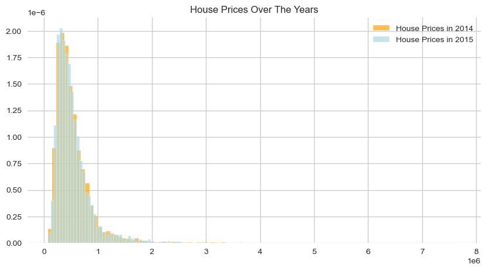
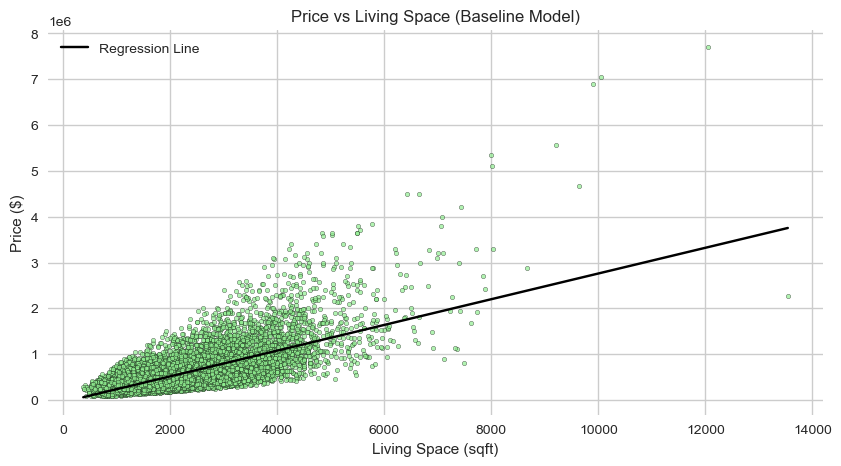
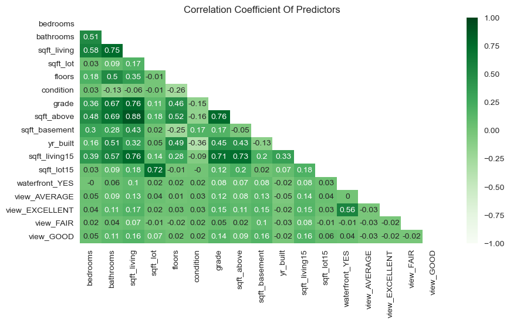
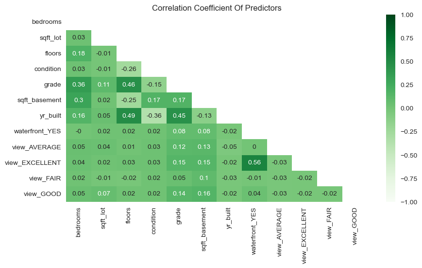

# **King County House Sales Analysis** ([Femi Kamau](https://www.github.com/ctrl-Karugu))   

> This project is a part of the [Data Science (DSF-FT) Course](https://moringaschool.com/courses/data-science-course/) at [Moringa School](https://moringaschool.com/). The full project description can be found [here](https://github.com/learn-co-curriculum/dsc-phase-2-project-v2-3).

---
---

## Overview

In our analysis, we explored the data provided by the stakeholder and build a multiple linear regression model with some the features stipulated in the dataset. From there, we analysed the results and came to a conclusion on the following factors that have a significant impact on the price of a house in King County:

- Have a house by the water
  
- Increase the number of bedrooms

- Improve the overall grade of the home

- Increase the number of floors

- Increase the size of the basement

- Strive to maintain the house to ensure that it is in good condition

---

### 1. Business Understanding

A real estate angency located in King County is looking to advice home owners about how home renovations might increase the value of their homes. The agency is looking to use the King County house data provided to determine the best renovations to make to increase the value of a home.

---

### 2. Data Understanding

There was no need to collect any data for this project as it was already provided by the stakeholder. The data consists of house data from King County and is in .csv format.

We have 15 Numerical Features and 6 Categorical Feature in the dataset.

- **Numerical Columns (15)** 
  
  `date` - Date house was sold

  `price` - Sale price (prediction target)

  `bedrooms` - Number of bedrooms

  `bathrooms` - Number of bathrooms

  `sqft_living` - Square footage of living space in the home

  `sqft_lot` - Square footage of the lot

  `floors` - Number of floors (levels) in house

  `sqft_above` - Square footage of house apart from basement

  `sqft_basement` - Square footage of the basement

  `yr_built` - Year when house was built

  `yr_renovated` - Year when house was renovated

  `lat` - Latitude coordinate

  `long` - Longitude coordinate

  `sqft_living15` - The square footage of interior housing living space for the nearest 15 neighbors
  
  `sqft_lot15` - The square footage of the land lots of the nearest 15 neighbors

- **Categorical Columns (6)**

  `id` - Unique ID for each home sold

  `waterfront` - Whether the house has a view to a waterfront

  `view` - An index from 0 to 4 of how good the view of the property was

  `condition` - An index from 1 to 5 on the condition of the house

  `grade` - An index from 1 to 13, where 1-3 falls short of building construction and design, 7 has an average level of construction and design, and 11-13 have a high quality level of construction and design

  `zipcode` - What zipcode area the house is in

  In our data undersranding phase we were able to get insights on the data using univariate analysis.

---

### 3. Data Preparation

Within our data preparation phase, we performed the following tasks:
-  Clean Data 
   -  Removed Duplicates
   -  Filled Missing Values
- Consruct Data
  - We looked to create a new column to standardise the the price of the homes across the dataset to account for the inflation in the housing market over the years. However, there was no difference between the distributions 
- Format Data
  - We converted the date column to datetime format
  - We also corrected the missing and erroneous in the basement square footage column

---

### 4. Modeling
#### 4.1 Select Modeling Techniques
> In this section, we shall be determining which algorithms to try

I believe that the best algorithm to try for this experiment is regression. Regression is a supervised learning algorithm that is used to predict the value of a dependent variable based on the value of the independent variables. In this case we are tying to estimate the effect that the different features of the homes has on our dependent variable, the price of the homes. As a result, we will be able to provide our stakeholder with a model that will be able to predict the most pivotal features of the homes that will have the most impact on the price of the homes.

Furthermore, as we are working with multiple features, we will be using multiple linear regression. Multiple linear regression is a regression algorithm that is used to predict the value of a dependent variable based on the value of multiple independent variables (unlike linear regression which only uses one independent variable).

#### 4.2 Build Models
> In this section, we shall be building the models.

We will first start by building a baseline model. The baseline model will be used to compare the performance of the other models that we will be building. After that, we will build our multiple linear regression model.

##### 4.2.1 Build Baseline Simple Linear Regression Model
> A baseline model is essentially a simple model that acts as a reference in a machine learning project. Its main function is to contextualize the results of trained models.

The target variable is price. Therefore, we look at the correlation coefficients for all of the predictor variables to find the one with the highest correlation with price.

 

Our most strongly correlated variable with `price` is `sqft_living`

The model is statistically significant as it explains only 50% of the variance in the data. However, it is a good starting point for our analysis. In a typical prediction, the model is off by about \$173992.
  
- The intercept is about -\$45130. This means that that a zero square foot house would be worth about - \$45130.
  
- The coefficient of `sqft_living` is about \$281. This means that for every square foot increase in the house, the price of the house increases by about \$281.

##### 4.2.2 Build Iterated Multiple Linear Regression Model
> We will now iterate the baseline model by building a multiple linear regression model that will have more than one independent variable.

We will start by creating a new dataframe that will contain all of the features that we want to have in our model. After that, we will encode the categorical columns. In order to know which variables to keep in our model, we will first look at a correlation matrix. This is done in order to reduce multicollinearity. Multicollinearity is a situation in which two or more independent variables are highly correlated. This can cause problems in the model as it can lead to unstable estimates of the regression coefficients. Therefore, we will be removing the variables that are highly correlated with each other.

**Initial Correlation Matrix**

**Final Correlation Matrix**

#### 4.3 Model Results Analysis

We can see that all of the variables in the model are statistically significant.

- We can see that constant value is about \$5,137,455. This means that a house with no features would be worth about \$5,137,455.
  
- The coefficient of `bedrooms` is \$16,240 which means that for every bedroom increase in the house, the price of the house increases by about \$16,240.

- The coefficient of `ssqft_lot` is \$0.14 which means that for every square foot increase in the lot, the price of the house increases by about \$0.14.

- The coefficient of `floors` is \$78,262 which means that for every floor increase in the house, the price of the house increases by about \$78,262.

- The coefficient of `condition` is \$19,443 which means that for every condition rating increase in the house, the price of the house increases by about \$19,443.

- The coefficient of `grade` is \$205,092 which means that for every grade rating increase in the house, the price of the house increases by about \$205,092.

- The coefficient of `sqft_basement` is \$119 which means that for every square foot increase in the basement, the price of the house increases by about \$119.

- The coefficient of `yr_built` is -\$3,277 which means that for every year increase in the year the house was built, the price of the house decreases by about \$3,277.

- The coefficient of `waterfront_YES` is \$540,924 this means that if a house is on a waterfront, the price of the house increases by about \$540,924.

- The coefficients for `view` range from \$69,941 to \$340,899
  
  - `view_AVERAGE` is \$69,941 which means that for an average view compared to no view, the price of the house increases by about \$69,941.
  
  - `view_FAIR` is \$131,058 which means that for a fair view compared to no view, the price of the house increases by about \$131,058.
  
  - `view_GOOD` is \$137,050 which means that for a good view compared to no view, the price of the house increases by about \$137,050.
  
  - `view_EXCELLENT` is \$340,899 which means that for an excellent view compared to no view, the price of the house increases by about \$340,899.

---

### 5. Conclusion
#### 5.1 Recommendations

Taking this analysis back to the original business problem, the aim was to help a real estate agency advise their clients on the best possible potential renovations to make to increase the the value. After modelling the data, we can see that the best renovations are as follows:

- Moving the house closer to the water. This will increase the value of the house by about \$540,924. As a result this most likely means that it make the view excellent as the two features are fairly correlated. In turn, by making the view excellent, the value of the house will increase by about \$340,899. However, this renovation can only be made if land is close water.

- The second best renovation to make is to improve the grade of the house. This will increase the value of the house by about \$205,092 for every grade.

- The third best renovation to make is to increase the number of floors in the house. This will increase the value of the house by about \$78,262 for every floor. However, it is worth mentioning that our data only had 3.5 floors as the maximum. Therefore, it is unlikely that this statistic would apply to a house with more than 3.5 floors.

- Increasing the number of bedrooms in the house will increase the value of the house by about \$16,240 for every bedroom. However, it is worth mentioning that our data only had 10 bedrooms as the maximum. Therefore, it is unlikely that this statistic would apply to a house with more than 10 bedrooms.

- Lastly, increasing the size of the basement will increase the value of the house by about \$119 for every square foot. However, it is worth mentioning that our data only had 4,820 square feet as the maximum. Therefore, it is unlikely that this statistic would apply to a house with more than 4,820 square feet.

#### 5.2 Limitations

Though our model did show a significant increase in the accuracy of the model, there are still some limitations to the model. These limitations are as follows:

- The data in the dataset is from 2014 and 2015. Therefore, it may not be able to account for changes in the housing market since then. As a result the model may not be able to predict the value of a house in 2022. 

---

Project Organization
------------

    ├── LICENSE
    ├── README.md          <- The top-level README for developers using this project.
    ├── data
    │   ├── processed      <- The final, canonical data sets for modeling.
    │   └── raw            <- The original, immutable data dump.
    │
    ├── notebooks          <- Jupyter notebooks. Naming convention is a number (for ordering),
    │
    ├── requirements.txt   <- The requirements file for reproducing the analysis environment, e.g.
    │                         generated with `pip freeze > requirements.txt`
    │
    ├── images             <- Both sourced externally and generated from code
  

